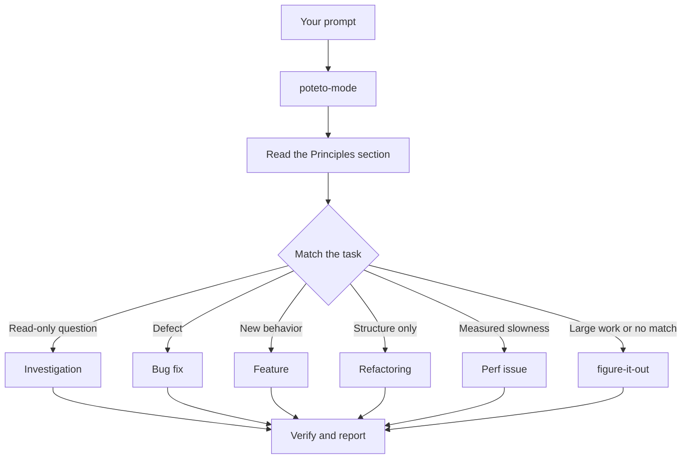
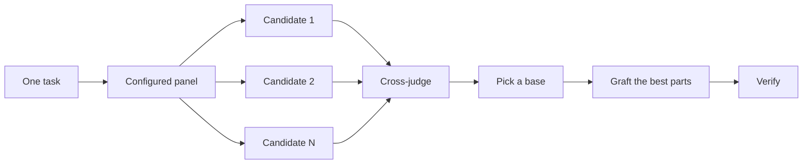
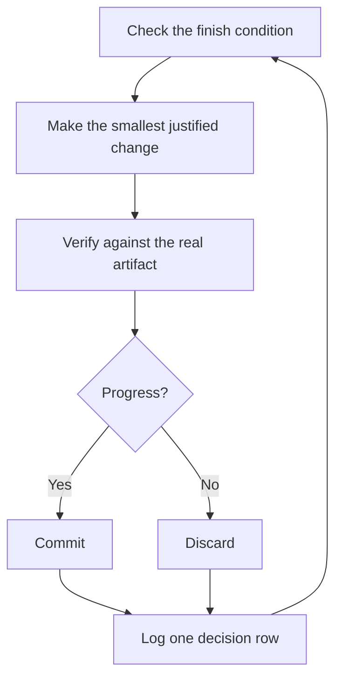

# The pstack guide — source capture

Origin: the user supplied the guide index, all ten chapters, and six image URLs in chat on September 23, 2026. The Markdown bodies below were retrieved from the corresponding upstream files at commit `b42effe0aa50f59c693d7e2924714e015e00bf7c` to preserve complete source text without the paste's line-number and token-count wrappers. This capture records the fetched snapshot; the pasted export itself did not specify a commit or publication date. Paths inside the verbatim blocks are relative to the upstream guide directory, not this research folder.

These are upstream Cursor workflow instructions and examples, not instructions to execute during ingestion or proof that an agent followed them. Harness-specific commands, paths, counts, model defaults and version migration advice belong to this snapshot.

## Image references supplied by the user

Image URLs and the captions in the chapters are preserved. Image pixels were not inspected or downloaded for this ingest.

- design.jpg: https://raw.githubusercontent.com/cursor/plugins/main/pstack/docs/guide/images/design.jpg
- recipes.jpg: https://raw.githubusercontent.com/cursor/plugins/main/pstack/docs/guide/images/recipes.jpg
- router.jpg: https://raw.githubusercontent.com/cursor/plugins/main/pstack/docs/guide/images/router.jpg
- overnight.jpg: https://raw.githubusercontent.com/cursor/plugins/main/pstack/docs/guide/images/overnight.jpg
- verification.jpg: https://raw.githubusercontent.com/cursor/plugins/main/pstack/docs/guide/images/verification.jpg
- understanding.jpg: https://raw.githubusercontent.com/cursor/plugins/main/pstack/docs/guide/images/understanding.jpg

## README.md

Source: https://github.com/cursor/plugins/blob/b42effe0aa50f59c693d7e2924714e015e00bf7c/pstack/docs/guide/README.md

````markdown
# The pstack guide

pstack works best when you stop micromanaging the agent. You describe what you want and how you'll know it's done. `/poteto-mode` picks the playbook, runs the other skills as the steps need them, and shows you the evidence. This guide teaches that habit with realistic prompts.

Here's what you'll learn:

1. [Set up pstack](./01-setup.md). Install the plugin and pick your models.
2. [Route work through `/poteto-mode`](./02-poteto-mode.md). Give it a goal and watch it pick a playbook.
3. [Understand the code](./03-understand.md). `/how`, `/why`, `/teach`, and `/recall` before you edit anything.
4. [Design the change](./04-design.md). `/architect`, `/arena`, `/swarm`, and `/interrogate` before code locks in a shape.
5. [Build and clean the change](./05-build-and-clean.md). The build playbooks, `/tdd`, `/unslop`, and `/no-comments`.
6. [Verify and ship](./06-verify-and-ship.md). Prove behavior on the real app, then open a focused PR and drive it to merged.
7. [Run work while you sleep](./07-overnight.md). An overnight contract, a decision log you can audit, and the playbooks that scale past one agent.
8. [Steer with principle names](./08-principles.md). The 23 names that redirect an agent mid-task.
9. [Make it yours](./09-make-it-yours.md). Your own mode, plus how to test a skill change.
10. [Recipes and pitfalls](./10-recipes-and-pitfalls.md). Prompts to copy and mistakes to skip.

Read the pages in order the first time. After that, each page stands alone.

## If you only remember one thing

Give the agent a goal and a way to check it, in your own words:

```text
/poteto-mode the export writes duplicate rows when a retry lands mid-run. repro first, then fix and verify.
```

You don't need to name a playbook or list skills. "repro first" and a checkable outcome are all the routing signal `/poteto-mode` needs. It matches the Bug fix playbook, copies the steps into a todo list, and calls the right skills as each step fires.

Next: [Set up pstack](./01-setup.md).
````

## 01-setup.md

Source: https://github.com/cursor/plugins/blob/b42effe0aa50f59c693d7e2924714e015e00bf7c/pstack/docs/guide/01-setup.md

````markdown
# Set up pstack

In this page you install the plugin, pick which models pstack uses, and run your first task. Setup is one command plus a short conversation.

## Install the plugin

In a Cursor chat, run:

```text
/add-plugin pstack
```

Cursor confirms the plugin is installed.

## Pick your models

Run:

```text
/setup-pstack
```

[`/setup-pstack`](../../skills/setup-pstack/SKILL.md) detects the models you have access to, asks for a reasoning budget, shows you each role (code delegates, judgment, the review panels), and asks what you want. Answer the questions. It writes `~/.cursor/rules/pstack-models.mdc`, a small rule every pstack skill reads.

You only override what you care about. A role with no line in the rule keeps the skill's default. To restore a default, delete that role's line. A rerun of `/setup-pstack` keeps any role whose model differs from the default. A rule written before 0.15.3 pins the old default models, so delete those role lines, or delete the file, then run `/setup-pstack` again.

You might be wondering what happens if you use Auto. Set a role to `inherit-parent` or `auto` and pstack omits the subagent `model` field, so the subagent inherits your parent chat model. Both values mean the same thing, and neither is a model slug. For a panel role the value is a list, and one subagent runs per entry, so the list length sets the panel size. Setup also configures `swarm workers`, the default model for every `/swarm` worker unless a race names a model for each arm.

## Accept the verification offer, or don't

At the end of setup, `/setup-pstack` looks for a way to prove app behavior in your project, either a `verify-*` skill or an existing harness. If it finds neither, it offers once to generate one with [`/create-verification-skill`](../../skills/create-verification-skill/SKILL.md).

Say yes and it writes `.cursor/skills/verify-<app>/`, a project-local skill that teaches agents to drive your app the way a user does. It proves the skill works once before handing it over. Say no and setup moves on. You can run `/create-verification-skill` yourself any time. [Verify and ship](./06-verify-and-ship.md#create-a-project-verification-skill) covers when it earns its place.

After setup, start a new chat. The model rule applies to new sessions.

## Run your first task

Pick something real but small, and describe it the way you'd describe it to a colleague:

```text
/poteto-mode add a --json flag to this command. text output stays byte-identical. verify both.
```

Watch the todo list. Its first items are the matched playbook's steps copied in, the Feature playbook for this prompt. If `/poteto-mode` skips a step, the step stays in the list with `skip: <reason>`, so you can see what it chose not to do.

From here you can type normal follow-ups. `/poteto-mode` is sticky. It stays on for the conversation until you opt out by saying so.

Next: [Route work through `/poteto-mode`](./02-poteto-mode.md).
````

## 02-poteto-mode.md

Source: https://github.com/cursor/plugins/blob/b42effe0aa50f59c693d7e2924714e015e00bf7c/pstack/docs/guide/02-poteto-mode.md

````markdown
# Route work through `/poteto-mode`

`/poteto-mode` is the front door. You give it a goal, it matches one of twenty-three playbooks, copies that playbook's steps into the todo list, and calls the other skills as the steps need them. In this page you learn what a good prompt looks like, and how little of one you actually need.


## What happens to your prompt



The diagram shows the common routes. There are also playbooks for hillclimbing a metric, diagnosing runtime symptoms and captured traces, prototypes, visual parity, authoring and evaluating skills, autonomous runs, babysitting a PR or stack to merge-ready, shipping a verified stack, running a PR queue on autopilot, orchestrating project-scale programs, session pickup, pausing safely, multi-phase plans, and worktree cleanup. The [playbook directory](../../skills/poteto-mode/playbooks/) has the full set.

## Say the goal, not the ceremony

You don't write a spec. You say what's wrong or what you want, plus anything you already know that saves the agent time:

```text
/poteto-mode users get two notifications after a retry. repro first, then fix and verify.
```

That's a Bug fix prompt. "repro first" is a real constraint, not politeness, and the playbook honors it. Watch the todo list fill with the Bug fix steps. A skipped step stays visible with `skip: <reason>`.

When the conversation already carries the context, the prompt shrinks to almost nothing. All of these are enough:

```text
/poteto-mode do it
```

```text
continue
```

```text
keep going until done
```

Short works because the mode is sticky and the playbook holds the structure. Your words carry the intent, and the skill carries the rigor.

## Switch tasks with "new task"

A long chat accumulates context from the last task. When you change subjects, say so:

```text
/poteto-mode new task. figure out why the cache entry survives logout. don't change any code yet.
```

"new task" tells `/poteto-mode` to re-match rather than continue the prior playbook. "don't change any code yet" pins this one to Investigation. Without those two phrases, a mode mid-Feature tends to treat your question as the next feature step.

## Give parallel work its own worktree

If you run several agents against one repository, they will fight over the working tree. Ask for isolation up front:

```text
/poteto-mode new task. branch off <base> in a fresh worktree, then port the parser change there.
```

Each task in its own branch and worktree means no agent stomps another's files. The [Opening a PR playbook](../../skills/poteto-mode/playbooks/opening-a-pr.md) already works from a worktree for code changes, so mostly you only say this when a specific base or location matters.

Worktrees accumulate. When disk gets tight, ask:

```text
/poteto-mode what's eating my disk? prune the worktrees that are safe to prune.
```

The [Worktree cleanup playbook](../../skills/poteto-mode/playbooks/worktree-cleanup.md) classifies every worktree by merge state, uncommitted work, and which chats still touch it. It deletes only what that evidence clears and pauses for your call on anything holding uncommitted work.

## Leave it running

When you step away, say what done means and go:

```text
/poteto-mode im stepping away. keep going until the migration check reports zero old callers. log your decisions.
```

Work you'll review later routes through [`/figure-it-out`](../../skills/figure-it-out/SKILL.md), which designs the run's phases and keeps a [`/show-me-your-work`](../../skills/show-me-your-work/SKILL.md) decision log. [Run work while you sleep](./07-overnight.md) covers the full overnight contract.

**Pitfall:** don't enumerate skills in your prompt ("use /how, then /architect, then /arena..."). The playbook already sequences them, and a hand-written sequence usually reorders or drops steps the playbook would have kept. Name a skill only when you want to override a specific choice.

Read [`poteto-mode`](../../skills/poteto-mode/SKILL.md) itself for the full routing rules.

Next: [Understand the code](./03-understand.md).
````

## 03-understand.md

Source: https://github.com/cursor/plugins/blob/b42effe0aa50f59c693d7e2924714e015e00bf7c/pstack/docs/guide/03-understand.md

````markdown
# Understand the code before changing it

Editing code you don't understand is how subtle regressions ship. pstack gives you four ways in. `/how` explains what the code does now. `/why` digs up the reasons it's shaped that way. `/teach` blends both into one explanation. `/recall` rebuilds your own recent context on a topic.


## Trace behavior with `/how`

```text
/how do we dedupe notifications? is there an n+1 when we look up subscribers?
```

Ask the question you actually have. [`/how`](../../skills/how/SKILL.md) reads the code and answers at the level of a senior engineer onboarding you onto the subsystem, with the runtime flow, the key types, and the non-obvious parts. For a big subsystem it fans out two to four read-only explorers first. For a narrow question it just reads and explains.

## Dig up history with `/why`

```text
/why was the retry limit set to five? does the reason still hold?
```

[`/why`](../../skills/why/SKILL.md) works like a detective on a cold case. It starts from source control, then queries whatever evidence categories your MCPs expose, such as the issue tracker, long-form docs, team chat, observability, error tracking, and analytics, all in parallel. The report cites everything, separates direct evidence from inference, and says "appears to" when the record is thin. A null result gets reported too, because "nobody wrote down why" is itself an answer.

The two compose naturally. `do why first then how` is a perfectly good prompt when you suspect the history explains the mess.

## Actually understand it with `/teach`

```text
/teach me how this PR changes retries. convince me it fixes the cause and not the symptom.
```

[`/teach`](../../skills/teach/SKILL.md) is for when a summary isn't enough. It runs `/how` and `/why`, for a small change maybe just one of them, and weaves the findings into a plain explanation that builds up diagram by diagram. The "convince me" framing is worth stealing. It turns the explanation into an argument you can poke at instead of a tour.

## Rebuild your own context with `/recall`

```text
/recall catch me up on the export work from last week
```

[`/recall`](../../skills/recall/SKILL.md) mines your own recent chats plus the shared record (issues, prior fixes, errors still firing) and hands back a brief on where things stand and what's next. Use it when you're returning to a topic cold. If you want to resume one specific chat, that's the Session pickup playbook below, not `/recall`.

## Take over prior work with Session pickup

When another agent (or you, last week) left a branch mid-flight:

```text
/poteto-mode take over this branch. read the decision log, figure out what's done, and continue from there. don't redo finished work.
```

The [Session pickup playbook](../../skills/poteto-mode/playbooks/session-pickup.md) treats the prior trail as authoritative. It reconstructs the branch state and decisions, names the resume point, and verifies inherited claims against the original goal instead of re-deriving everything from scratch.

**Pitfall:** don't skip this page's skills because "the agent will read the code anyway." An agent that starts editing without a traced model tends to fix the symptom at the first plausible spot. `/how` first is cheaper than the second bug.

Next: [Design the change](./04-design.md).
````

## 04-design.md

Source: https://github.com/cursor/plugins/blob/b42effe0aa50f59c693d7e2924714e015e00bf7c/pstack/docs/guide/04-design.md

````markdown
# Design before you write code

One attempt at a hard design locks in the first shape the model thought of. `/architect` settles types and boundaries before implementation. `/arena` runs several attempts at the same brief and merges the best parts. `/interrogate` has other models try to break the result. When the job is coverage rather than design synthesis, `/swarm` fans out slices or races and aggregates their results.


## Settle the shape with `/architect`

```text
/architect design the import pipeline before writing any code. i care most about how callers use it.
```

[`/architect`](../../skills/architect/SKILL.md) grounds itself first, running `/how` over the code the design touches and `/why` when it moves ownership or layers. Then it runs `/arena` to produce competing design sketches, with the caller's usage written first in each, followed by types, signatures, and a module map.

By default it proceeds straight from the synthesized design into implementation. If you want to see the design first, say so:

```text
/architect with checkpoint. stop and show me before implementing.
```

## Fan out attempts with `/arena`

```text
/arena take my prompt to the arena verbatim. i want to compare their proposals with yours.
```

[`/arena`](../../skills/arena/SKILL.md) is the general tool underneath. N subagents attempt the same design or code brief in parallel, each writing to its own worktree or directory. A read-only judge, on a different model family when your configuration allows one, scores every candidate against a rubric. The coordinator reads each candidate end to end, picks a base, grafts in the best ideas from the losers, and verifies the result.



The panel comes from your [`/setup-pstack`](../../skills/setup-pstack/SKILL.md) configuration, and you can adjust it per task. Ask for more candidates when the decision matters, fewer when it doesn't:

```text
/arena this, 5 candidates. the cache key format is expensive to change later.
```

## Cover slices and races with `/swarm`

```text
/swarm check every package under packages/ against its check.sh. one worker per package. one report.
```

[`/swarm`](../../skills/swarm/SKILL.md) fans N workers across independent slices, coverage matrices, gauntlet lanes, exploration partitions, or declared race arms. Each worker gets its own scope and check, then reports `PASS`, `ISSUES`, or `BLOCKED`. The parent waits for the workers and returns one compact report with any gaps or dropouts.

Reach for it when parallelism buys coverage or lets independent checks race. `/arena` gives every worker the same design or code brief, then picks a base and grafts the best parts. `/swarm` covers slices or runs a race with a selection rule declared up front. It does not use the base-selection and grafting ceremony.

## Break it with `/interrogate`

```text
/interrogate the whole branch, but skeptically. no nitpicks unless it's an actual bug or regression.
```

[`/interrogate`](../../skills/interrogate/SKILL.md) sends the same diff, intent, and rubric to several reviewers on different model families. Model diversity is the point. Different models have different blind spots, so a finding two models raise independently is high-confidence signal. The lead sorts everything into `Act on`, `Consider`, `Noted`, and `Dismissed`, with a reason for each dismissal, and applies nothing automatically.

Read the dismissals too. The lead is a pragmatic senior engineer, not an oracle, and you can override it.

## How much design work does a task deserve?

You might be wondering whether every change needs this. No. Most changes need none of it. A rough ladder:

- A small, finished change you're unsure about needs `/interrogate` alone.
- A change that crosses function boundaries or moves ownership earns `/architect`, which brings `/arena` with it.
- A standalone decision where independent attempts would help, like naming, formats, or an algorithm, is `/arena` directly.
- A coverage matrix, set of parallel checks, or race with declared arms is `/swarm`.
- A contested design that's expensive to reverse gets `/architect`, then `/interrogate` before shipping.

`/poteto-mode` already applies this ladder. Boundary-crossing work triggers `/architect` on its own, so you reach for these directly mainly when you want more or less scrutiny than the default.

Next: [Build and clean the change](./05-build-and-clean.md).
````

## 05-build-and-clean.md

Source: https://github.com/cursor/plugins/blob/b42effe0aa50f59c693d7e2924714e015e00bf7c/pstack/docs/guide/05-build-and-clean.md

````markdown
# Build the change and clean the diff

The build playbooks share one discipline. Say what you observed, let the playbook demand the evidence. This page shows what to put in the prompt for each common build task, then the cleanup habit that keeps diffs reviewable.

## Prompt each build playbook with what you know

A bug prompt states the symptom and asks for a reproduction first:

```text
/poteto-mode this command emits two records after a retry. repro first, then fix and verify.
```

A feature prompt states the behavior and what must not change:

```text
/poteto-mode add a --json flag. text output stays byte-identical. verify both forms.
```

A refactoring prompt pins behavior before structure moves:

```text
/poteto-mode move parsing into one module, zero behavior change. record the current output first and prove it's unchanged after.
```

A perf prompt states the measurement, not a vibe:

```text
/poteto-mode startup takes 1.8s on this fixture. trace it, fix the measured cause, show me before and after.
```

Each of these routes to its playbook ([Bug fix](../../skills/poteto-mode/playbooks/bug-fix.md), [Feature](../../skills/poteto-mode/playbooks/feature.md), [Refactoring](../../skills/poteto-mode/playbooks/refactoring.md), [Perf issue](../../skills/poteto-mode/playbooks/perf-issue.md)), and the playbook supplies the steps you didn't type: reproduce before fixing, name the data shape before implementing, pin behavior before restructuring, profile before optimizing.

For sustained improvement of one number, there's the [Hillclimb playbook](../../skills/poteto-mode/playbooks/hillclimb.md). Give it the metric, a target, and a floor on attempts, and it loops one hypothesis at a time with a frozen measurement harness. It keeps wins and reverts everything else.

## Write the failing test first with `/tdd`

When a bug has a cheap local test path, the whole prompt can be two words:

```text
/tdd implement
```

In context, that's enough. [`/tdd`](../../skills/tdd/SKILL.md) writes the smallest test that fails for the intended reason, then the fix, then reruns the test. If a test would need broad harness setup or brittle mocks, the skill says so and uses the closest executable check instead. Don't force a test where a real command is stronger evidence.

## Let the TypeScript rules load themselves

[`typescript-best-practices`](../../skills/typescript-best-practices/SKILL.md) has no slash command in your workflow. It loads whenever the agent touches a `.ts` or `.tsx` file and turns the type-system principles into concrete rules: discriminated unions, `unknown` at boundaries, exhaustive variants, schema-derived types.

## Clean before you commit

The [Opening a PR playbook](../../skills/poteto-mode/playbooks/opening-a-pr.md) runs `/deslop` on the diff before each commit and applies [`/unslop`](../../skills/unslop/SKILL.md) to the PR description and commit bodies. `/deslop` ships in the `cursor-team-kit` plugin, not in pstack. If you don't have it, ask for the same outcome in plain words: remove narrating comments, unsupported guards, dead compatibility paths, and unrelated edits.

For prose, `/unslop` takes a target and any extra rules you have:

```text
/unslop the readme changes, no emdashes
```

You'll develop your own shorthand. The skill reads intent fine from terse prompts like `unslop that, tighten it`.

## Strip the comments with `/no-comments`

Comments need their own pass, and not from the agent that wrote them. An author defends its comments the way you'd defend yours. So before review, hand them to fresh eyes:

```text
/no-comments the diff
```

[`/no-comments`](../../skills/no-comments/SKILL.md) spawns [Comment Sicko](../../agents/comment-sicko.md), a read-only reviewer with a short keep list: license headers, doc comments on a public API, links that explain what code can't, behavior forced by an external dependency you can't reshape. Everything else goes. A surprise in your own code gets no such pass. The comment comes back as a refactor flag, and `/no-comments` fixes the flags it accepts at the root cause. When a comment claims a constraint, "do not remove", the skill offers to encode the claim as a type, test, or lint. Either way, the comment comes out.

The division of labor is worth keeping straight. `/deslop` cleans slop out of the code, `/unslop` cleans it out of prose, and `/no-comments` hands the comments to a reviewer who didn't write them.

**Pitfall:** cleanup is not optional polish. A diff with narrating comments and defensive dead weight reads as unfinished to reviewers, and the extra code is where the next bug hides. If the diff feels padded, say `deslop it` before you commit, not after review calls it out.

Next: [Verify and ship](./06-verify-and-ship.md).
````

## 06-verify-and-ship.md

Source: https://github.com/cursor/plugins/blob/b42effe0aa50f59c693d7e2924714e015e00bf7c/pstack/docs/guide/06-verify-and-ship.md

````markdown
# Verify the result and open a PR

"It compiles" is not evidence. The [Prove It Works principle](../../skills/principle-prove-it-works/SKILL.md) makes the agent check the real artifact before it reports success, and your job is to make "the real artifact" checkable. This page covers stating a finish condition, generating a verification skill for your app, opening the PR, and driving it to merged.


## State the finish condition up front

Put what done means in the first prompt, in whatever words fit:

```text
/poteto-mode add json output to this command. text output stays byte-identical, the json parses, both run against the sample project. show me the evidence.
```

Now the agent has three checks it can run, not a mood to satisfy. When the reply comes back, it should carry the exact commands and outputs. If a check couldn't run, a good reply says "inconclusive", and you should treat a confident reply without evidence as a red flag.

Match the check to the change:

- A CLI change runs the real command.
- A UI change walks the changed flow in the running app.
- A parser or migration replays a saved input.
- A perf change compares before and after profiles.
- A storage change reads back the written value.

For a small diff you don't fully trust, [`/blast-radius`](../../skills/blast-radius/SKILL.md) finds what it could break elsewhere. It picks the one fact the change is safe because of and proves it by running code instead of writing an essay about it.

## Create a project verification skill

The UI bullet above hides a real requirement. The agent needs a scripted way to drive your app. If your project has one, great. If not, run:

```text
/create-verification-skill
```

[`/create-verification-skill`](../../skills/create-verification-skill/SKILL.md) interviews the repository, not you. It works out what a user touches, how the app launches locally, what can drive it (an existing harness first, otherwise browser and CDP, a PTY, or plain HTTP), what evidence proves behavior, and whether two instances can run side by side. It asks you only what the code can't answer.

It writes `.cursor/skills/verify-<app>/`, agent-facing instructions with exact Launch, Doctor, Drive, Evidence, and Cleanup sections, plus a feature map under `features/` that indexes what the app does and what result proves each feature works. The skill ships a [worked feature-map example](../../skills/create-verification-skill/references/feature-map-example/) with a README index and one file per feature using the four required H2s. Before handing it over, the generator proves the skill once end to end: launch, doctor check, drive one feature, capture evidence, clean up. If that proof fails, don't use the output.

From then on, "verify it in the app" is a step any agent can execute, in this repo, with no setup conversation.

Once the verify skill works, a [`/swarm`](../../skills/swarm/SKILL.md) can split a full pass by feature-map entry and aggregate the results.

## Keep the verification skill honest

Apps change and feature maps rot. When yours drifts, run:

```text
/maintain-verification-skill
```

[`/maintain-verification-skill`](../../skills/maintain-verification-skill/SKILL.md) audits the generated skill: one read-only source reader per feature in parallel, then one live pass that drives every mapped feature. It ends in exactly one of three outcomes. `clean` means full coverage and nothing to ship. `changed` means one PR of proven corrections, confined to the verification skill's own directory. `blocked` names the blocker. It never edits product code. If the live pass catches a product regression, it reports the regression instead of papering over it in docs.

## Open the PR

```text
/poteto-mode open the pr. small ordered commits, evidence in the description.
```

The [Opening a PR playbook](../../skills/poteto-mode/playbooks/opening-a-pr.md) works from a worktree, rebases the work into small ordered commits, cleans the diff, unslops the prose, and returns the PR link. Five narrow PRs beat one fat one, and stacked follow-ups beat a growing branch.

## Drive the PR to merge-ready with Babysit

An open PR starts collecting blockers immediately. Checks fail, reviewers comment, trunk moves. Hand that churn to the [Babysit playbook](../../skills/poteto-mode/playbooks/babysit.md):

```text
/poteto-mode babysit this pr. get it green.
```

Babysit watches the PR with a bundled watcher and takes blockers in order: conflicts, then review threads, then CI. Every known fix batches into one push, so the checks restart once instead of after every fix. The comment triage is skeptical, because humans and bots file real catches and noise in the same list. A real finding gets a fix, and noise gets dismissed with the disproof posted on the thread. When all you want is status, ask smaller and Babysit answers without starting the loop:

```text
/poteto-mode check on pr 123. anything outstanding?
```

Babysit stops at merge-ready. It never merges, even with everything green, because merging is a different decision.

## Land the stack with Shipping

Green is not the same as safe. When you're ready to land, say so:

```text
/poteto-mode land the stack.
```

The [Shipping playbook](../../skills/poteto-mode/playbooks/shipping.md) verifies each PR independently before it arms anything. One fresh agent per PR proves the behavior live, and the agent that judges a change is never the one that wrote it. Then Shipping lands only the contiguous verified run from the bottom, one PR at a time through GitHub by default or Origin when its CLI is available, and reports the first PR that breaks the chain. A verified PR sitting above an unverified one waits, because merging it would pull the gap in underneath.

Next: [Run work while you sleep](./07-overnight.md).
````

## 07-overnight.md

Source: https://github.com/cursor/plugins/blob/b42effe0aa50f59c693d7e2924714e015e00bf7c/pstack/docs/guide/07-overnight.md

````markdown
# Run work while you sleep

This is the payoff for everything before it. An agent you can trust to verify its own work is an agent you can leave alone with a hard task. What makes that safe isn't hope. It's a checkable finish condition, an isolated worktree, and a decision log you audit in the morning.


## The overnight contract

A good handoff has the goal, the finish condition, permissions, and an escape hatch. It doesn't need to be long:

```text
/poteto-mode im going to bed. migrate every caller to the new parser in a fresh worktree off <base>.
done means zero old callers, all parser fixtures pass, old api deleted.
keep a decision log. don't ask me before committing.
/loop until done. if you're truly stuck after a few hours, stop and write up why.
```

Walk through what each line buys you:

- "im going to bed" is a session override. The agent stops asking and keeps going.
- "done means..." turns the goal into checks every iteration can run.
- "fresh worktree off `<base>`" keeps the run from colliding with anything else you have open.
- "don't ask me before committing" pre-answers the permission the agent would otherwise block on.
- `/loop` is Cursor's built-in wake mechanism, not a pstack skill. The [Autonomous run playbook](../../skills/poteto-mode/playbooks/autonomous-run.md) uses it to re-check the finish condition on events or a heartbeat.
- The escape hatch lets it stop at a genuine dead end and write up why, which beats eight hours of creative goal reinterpretation.

Because you'll review this work after stepping away, `/poteto-mode` routes it through [`/figure-it-out`](../../skills/figure-it-out/SKILL.md), which designs the run's phases before any code and wires in the decision log.

## What the loop does all night



One change, one check, one log row, every iteration. Changes that didn't help get discarded, not left to ride. A plateau means pivot, not stop, and the finish condition never quietly relaxes to declare victory.

## The morning audit

[`/show-me-your-work`](../../skills/show-me-your-work/SKILL.md) is what makes the run reviewable. Each row records the time, phase, decision, reason, an evidence pointer, and the result, in a TSV at `decisions.tsv` (or `.audit/<task-slug>.tsv` when several runs share a directory). It stays local by default. Commit it when the work is ambitious enough that a reviewer needs the trail to trust the result.

When you're back, ask for the run in review form:

```text
/show-me-your-work catch me up on what you did last night
```

Before the skill hands back its summary, it spawns a reviewer on a different model family to read the trail and the transcript, and the reply ends with an Attention section listing what deserves your scrutiny. Read that section first, then the log rows it points at. You're auditing decisions, not re-reading the whole night.

## When the night holds a queue, not a task

The contract above drives one task to one finish condition. Some nights hold more, a queue of independent changes or a whole program. Three playbooks scale the same trust up.

[Autopilot-full](../../skills/poteto-mode/playbooks/autopilot-full.md) runs a queue of independent PRs to merged. Each PR gets one owner agent that carries it from build through merge, and no owner merges on its own verdict. A swarm of fresh verifiers starts a round at the owner's code-ready head and again at every later push that changes the patch. Only a clean verdict on the patch that merges authorizes the merge:

```text
/poteto-mode full autopilot on this queue. each item is independent. i want them merged by morning.
```

[Autopilot-stack](../../skills/poteto-mode/playbooks/autopilot-stack.md) runs the same owner loop but ships nothing. You wake up to one linear base-branch stack with a verifier's verdict on every link, and you review and land it yourself. Pick it over Autopilot-full when the changes are coupled, or when you want your own eyes on the work before anything merges:

```text
/poteto-mode autopilot these five changes but stack them, don't ship. i'll land the stack in the morning.
```

[Orchestrate](../../skills/poteto-mode/playbooks/orchestrate.md) is for a program that outlives any single agent: multi-day, many stacked PRs, fleets of subagents under one standing coordinator chat. The coordinator authors briefs, collects what its subagents finish, keeps the lowest unmerged PR green, and never writes code itself. It's deliberately heavy machinery. If one agent could finish the work in a session, the playbook itself routes you back to the overnight contract above:

```text
/poteto-mode orchestrate the store migration. own it until every package is converted and merged. i'll check in twice a day.
```

**Pitfall:** a duration is not a finish condition. "work on this for 4 hours" gives the agent nothing to check, and you'll wake up to four hours of motion instead of a result. Give `/loop` a predicate that can pass or fail.

Next: [Steer with principle names](./08-principles.md).
````

## 08-principles.md

Source: https://github.com/cursor/plugins/blob/b42effe0aa50f59c693d7e2924714e015e00bf7c/pstack/docs/guide/08-principles.md

````markdown
# Steer with principle names

pstack ships 23 principles as individual skills. `/poteto-mode` reads their index at the start of every multi-step task, applies the ones the task triggers, and names each applied principle in its reply along with the decision it changed.

You don't invoke principles. You use their names to steer. Each name points at a complete rule the agent has already read, so one phrase redirects the work more precisely than a paragraph of instructions.

## Steering in practice

Say the agent is about to bolt a new adapter onto three existing ones:

```text
use subtract before you add. delete the obsolete adapters first, then design what's left.
```

Say it claims success because the build passed:

```text
apply prove it works. run the real import flow and show me the written records.
```

Say two parallel attempts are about to write to the same branch:

```text
separate before serializing shared state. give each attempt its own worktree, no locks.
```

Each phrase lands because the rule behind it is specific. The agent still has to say, in its reply, which decision the rule changed. A principle citation with no decision behind it is the tell that it name-dropped instead of applying.

## The 23, briefly

The core principles decide how much to build and when to rethink the design:

- [Laziness Protocol](../../skills/principle-laziness-protocol/SKILL.md) prefers deletion and the smallest change that solves the problem.
- [Foundational Thinking](../../skills/principle-foundational-thinking/SKILL.md) chooses the core data structures before writing logic.
- [Redesign from First Principles](../../skills/principle-redesign-from-first-principles/SKILL.md) integrates a new requirement as if it had been there from day one.
- [Attack the Premise](../../skills/principle-attack-the-premise/SKILL.md) questions the premise that two or more failed fixes shared, after a census of which actors hold the imbalance.
- [Subtract Before You Add](../../skills/principle-subtract-before-you-add/SKILL.md) removes dead weight before building on top of it.
- [Minimize Reader Load](../../skills/principle-minimize-reader-load/SKILL.md) collapses layers and hidden state a reader must hold in their head.
- [Outcome-Oriented Execution](../../skills/principle-outcome-oriented-execution/SKILL.md) converges rewrites on the target design instead of preserving throwaway compatibility states.
- [Experience First](../../skills/principle-experience-first/SKILL.md) chooses the user's result over implementation convenience.
- [Exhaust the Design Space](../../skills/principle-exhaust-the-design-space/SKILL.md) builds two or three competing prototypes when there's no precedent.
- [Build the Lever](../../skills/principle-build-the-lever/SKILL.md) builds the script that does or proves the work, so a reviewer can rerun it.

The architecture principles decide where state, validation, and compatibility live:

- [Model the Domain](../../skills/principle-model-the-domain/SKILL.md) encodes repeated rules in one structure, not scattered conditionals.
- [Boundary Discipline](../../skills/principle-boundary-discipline/SKILL.md) validates at the boundary and trusts internal types.
- [Type System Discipline](../../skills/principle-type-system-discipline/SKILL.md) makes illegal states unrepresentable.
- [Make Operations Idempotent](../../skills/principle-make-operations-idempotent/SKILL.md) converges retries on the same end state.
- [Migrate Callers Then Delete Legacy APIs](../../skills/principle-migrate-callers-then-delete-legacy-apis/SKILL.md) migrates and deletes in one wave.
- [Separate Before Serializing Shared State](../../skills/principle-separate-before-serializing-shared-state/SKILL.md) removes the sharing before adding coordination.

The verification principles define what counts as proof:

- [Prove It Works](../../skills/principle-prove-it-works/SKILL.md) verifies the real artifact, not a proxy.
- [Fix Root Causes](../../skills/principle-fix-root-causes/SKILL.md) reproduces and traces to the cause before changing code.
- [Sequence Work into Verifiable Units](../../skills/principle-sequence-verifiable-units/SKILL.md) ends each small unit in a check before starting the next.
- [Test Behavior, Not Implementation](../../skills/principle-test-behavior-not-implementation/SKILL.md) calls the code the way its users do and asserts a literal expected value, and deletes a test that would still pass if every imported function returned `undefined`.

The delegation principles keep parallel work sane:

- [Guard the Context Window](../../skills/principle-guard-the-context-window/SKILL.md) routes bulk reading to subagents and keeps findings in the main chat.
- [Never Block on the Human](../../skills/principle-never-block-on-the-human/SKILL.md) proceeds on reversible work and presents the result.

And one meta principle:

- [Encode Lessons in Structure](../../skills/principle-encode-lessons-in-structure/SKILL.md) turns advice you've repeated twice into a lint, check, or script.

Don't memorize the list. Skim it now, then come back when you catch the agent doing something a name here would have prevented. That's how the vocabulary sticks.

Next: [Make it yours](./09-make-it-yours.md).
````

## 09-make-it-yours.md

Source: https://github.com/cursor/plugins/blob/b42effe0aa50f59c693d7e2924714e015e00bf7c/pstack/docs/guide/09-make-it-yours.md

````markdown
# Make it yours

poteto-mode is one person's style. The machinery underneath, playbooks, routing, model roles, works just as well wearing yours. This page covers generating a personal mode, capturing lessons from a session, authoring a focused skill, and testing a skill change before you trust it.

## Generate your own mode with `/automate-me`

```text
/automate-me
```

You don't describe your style, because [`/automate-me`](../../skills/automate-me/SKILL.md) reads it out of your history. It mines your recent transcripts in the active workspace for repeated preferences, in how you like replies, delegation, verification, code, prose, and process, then asks you which patterns are really you. It drafts `.cursor/skills/<your-name>-mode/SKILL.md` through Cursor's built-in `create-skill` flow, runs the draft through [`/unslop`](../../skills/unslop/SKILL.md), and opens a PR from a worktree so you review it like any other change.

Run it again whenever your habits drift:

```text
/automate-me update my mode skill with everything since its last edit
```

Update mode mines only the history since the skill last changed. It keeps rules you haven't contradicted, revises the ones with new evidence, and adds sections only for genuinely new patterns.

## Capture a session's lessons with `/reflect`

Right after a task that taught you something, run:

```text
/reflect that took way too long. capture what we learned so the next run doesn't repeat it.
```

[`/reflect`](../../skills/reflect/SKILL.md) sends the transcript to three parallel reviewers, then a synthesizer sorts the proposals into `Accepted`, `Rejected`, and `Backlog` and waits for your approval before any skill changes. Approve a proposal only if it would change a future decision. One weird session is an anecdote, not a rule.

## Author a focused skill

When you already know the workflow you want to capture:

```text
/poteto-mode write a skill for verifying database migrations in this repo
```

Writing a skill matches the [Authoring or modifying a skill playbook](../../skills/poteto-mode/playbooks/authoring-a-skill.md), which routes through Cursor's built-in `create-skill`, validates the frontmatter and links, and ships the result through the Opening a PR playbook. Agent-facing prose has a higher bar than human prose, because an unhelpful sentence becomes an instruction some future agent follows. Let the playbook hold that bar rather than writing a `SKILL.md` freehand.

One special case has its own generator. A skill that must drive your app and prove behavior is a verification skill, so use [`/create-verification-skill`](../../skills/create-verification-skill/SKILL.md) and [`/maintain-verification-skill`](../../skills/maintain-verification-skill/SKILL.md) instead. [Verify and ship](./06-verify-and-ship.md#create-a-project-verification-skill) covers both.

## Write docs to a standard with `/technical-writing`

Skills aren't the only prose you ship. For docs, RFCs, readmes, PR descriptions, and commit messages:

```text
/technical-writing review the readme changes
```

[`/technical-writing`](../../skills/technical-writing/SKILL.md) applies a layered standard with one goal, prose a tired engineer understands on the first read. It picks the document's mode first (tutorial, how-to, reference, or explanation), then works sentence by sentence: who does what, one thought per sentence, nothing readable two ways. Use it to review what you or an agent just wrote, or name it up front when you ask for a doc.

## Test a skill change blind

A skill edit affects every future session, so test it like the experiment it is:

```text
/poteto-mode run the eval playbook on this skill change. same task for both variants, candidates stay blind.
```

The [Eval playbook](../../skills/poteto-mode/playbooks/eval.md) is built around one failure mode, the observer effect. An agent that knows it's being evaluated behaves differently. So candidate agents get an organic-looking task in sanitized directories, never the words "eval" or "candidate", and never each other's existence. One judge scores all outputs under neutral labels, and chain-following gets graded from which files each candidate actually read, not from what it claims.

Read every output yourself before accepting the verdict. If you disagree with the judge, suspect the rubric before you suspect your judgment.

**Pitfall:** don't edit a skill mid-task because it's misbehaving. Fix it in its own PR and keep the task moving. A skill edit that ships tangled into feature work is invisible to review and impossible to evaluate.

Next: [Recipes and pitfalls](./10-recipes-and-pitfalls.md).
````

## 10-recipes-and-pitfalls.md

Source: https://github.com/cursor/plugins/blob/b42effe0aa50f59c693d7e2924714e015e00bf7c/pstack/docs/guide/10-recipes-and-pitfalls.md

````markdown
# Recipes and pitfalls

Prompts worth copying, then the mistakes everyone makes once. Swap in your own paths and finish conditions. The recipes are deliberately informal. That's how they get typed in practice, and the skills read intent fine.


## Understand an unfamiliar subsystem

```text
use /how first to understand how this initialization works. then use /why to figure out why it broke recently.
```

Mechanics first, history second. Each skill's report tells you which sources it searched, so you know what the answer is grounded in.

## Get a second opinion on a design

```text
ask /arena for a second opinion on this thread and our approach
```

Your current design becomes one candidate among several, and the synthesis tells you whether the panel found something better or confirmed what you had. Cheap insurance before a costly commitment.

## Check independent slices in parallel

```text
/swarm check every package under packages/ against its check.sh. one worker per package. one report.
```

Each worker owns one package. The parent waits for every slice and returns one `PASS`, `ISSUES`, or `BLOCKED` report instead of raw worker dumps.

## Review a branch skeptically

```text
/interrogate the whole branch, but skeptically. don't change anything yet. no nitpicks unless it's an actual bug or regression in behavior.
```

The qualifiers do real work. "don't change anything yet" keeps it read-only, and the nitpick rule pre-filters the noise so `Act on` findings are worth your time.

## Fix a bug through a failing test

```text
/poteto-mode repro the duplicate write first. if there's a cheap test path, /tdd it. then fix and rerun.
```

"if there's a cheap test path" matters. Forcing a test through brittle mocks proves less than running the real command, and the playbook is allowed to say so.

## Keep a run honest while you're away

```text
im going to bed, keep going autonomously until every fixture passes. do not stop. keep a decision log i can audit in the morning.
```

The full contract is on the [overnight page](./07-overnight.md). The short form works once the task and finish condition are already in the conversation.

## Redirect a drifting run

Steering prompts are one line:

```text
i said the goal is to repro. i did not ask for a fix yet.
```

```text
apply prove it works. show me the real output, not the build log.
```

```text
/unslop that, no emdashes
```

You rarely need more words. You need the right name, and [the principles page](./08-principles.md) is the vocabulary.

## Get the reply in plain words

```text
/bro
```

That's the whole prompt. [`/bro`](../../skills/bro/SKILL.md) restates the last message like one human talking to another, no jargon, shorter. Use it when a reply is technically thorough and you still don't know what it said.

## The pitfalls

- **Enumerating skills in the prompt.** "use /how then /architect then /arena" reorders steps the playbook already sequences. State the goal and constraints. Name a skill only to override a default.
- **A vague finish condition.** "make it better" gives `/loop` nothing to check. Give a command or artifact that can pass or fail.
- **Parallel agents in one worktree.** They overwrite each other and the diff becomes archaeology. Say "own worktree per attempt" and the isolation is free.
- **Using `/arena` for coverage.** `/arena` repeats one design or code brief, then picks a base and grafts the best parts. `/swarm` partitions slices or declared race arms and aggregates one report.
- **Accepting every review comment.** Bots and humans both file real catches and noise in one list. `/interrogate` sorts findings into act-on and dismissed buckets with reasons, and you can override either way.
- **Treating `auto` as a model slug.** `auto` and `inherit-parent` mean "omit the model field so the subagent inherits the parent chat model." [Setup](./01-setup.md) covers the roles.
- **Reporting success off a green build.** A build proves it compiles. Ask for the real command, flow, stored value, or profile, and expect the evidence in the reply.
- **Writing a `SKILL.md` freehand.** Route it through the [Authoring or modifying a skill playbook](../../skills/poteto-mode/playbooks/authoring-a-skill.md) so validation and review happen.

That's the guide. If you skipped ahead, go back to [setup](./01-setup.md) and run one real task. The habits stick from use, not from reading.

Back to the [guide index](./README.md).
````
